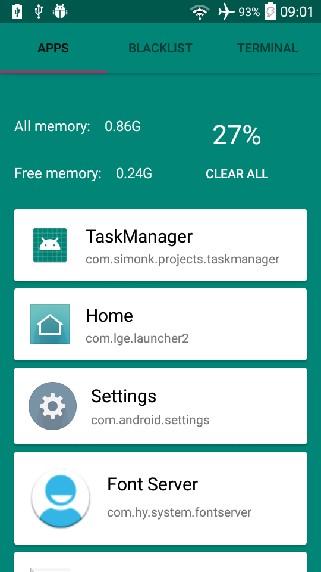
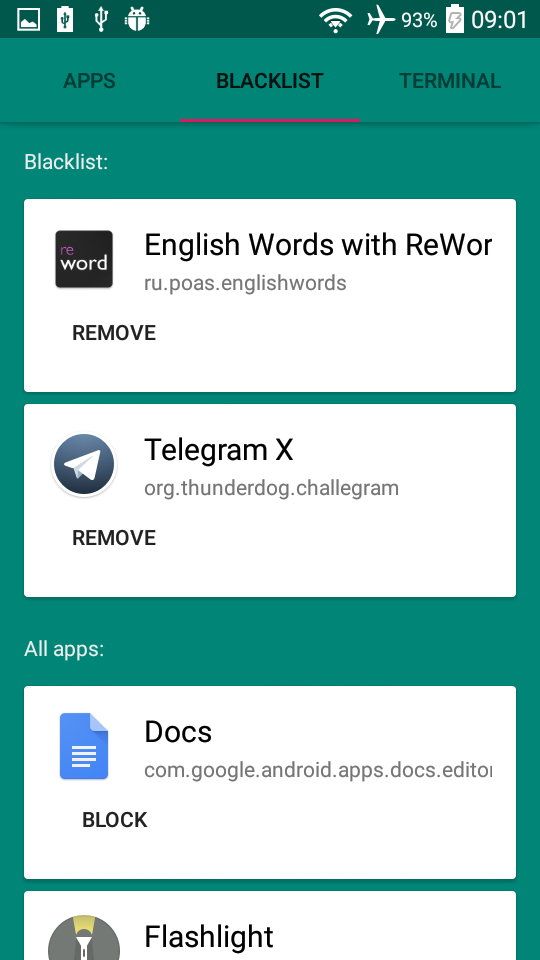
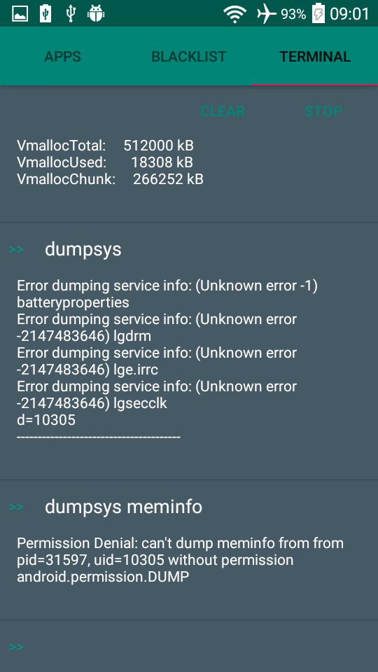

# Android-Process-Manager - beautiful manager of processes, apps and terminal for Android

Apps provide you information about memory usage and help you to clean unnecessary running apps. 
Let you block running apps in backgroud and also show scary message when you (or not you) launch other app that was added in blacklist of this app - parental control you need!
But if you wanna work with processes and apps like a pro, you can use terminal and send requests to Android shell

### You've never seen anything like this before!!!

### Features:
* Show running processes
* Kill a process you want
* Show you memory usage
* Clean memory as much as possible
* Show additional information about process
* Show all installed (and not system) apps
* Add apps in blacklist
* Removes apps from blacklist in background while you sleep
* Show notification with scary message when blocked app is running
* Show last time blocked app was opened (for parental control, yeah)
* Let you work with Android shell

### Languages supported:
* English
* Russian

### Screenshots:

  

  

  

